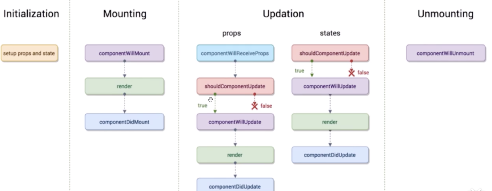
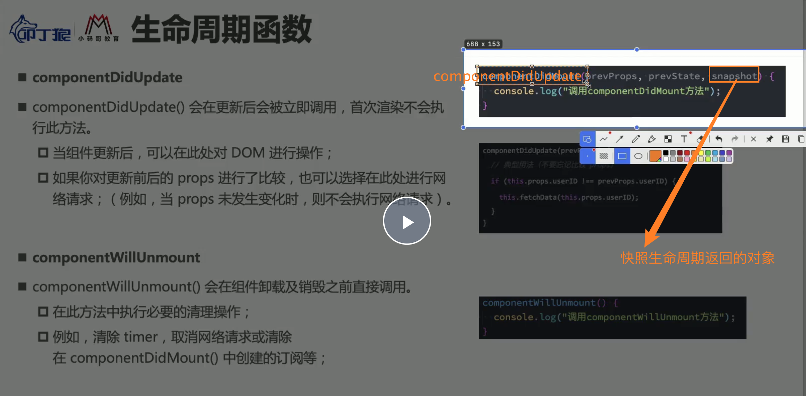

# React生命周期
> 图：https://projects.wojtekmaj.pl/react-lifecycle-methods-diagram/

+ 生命周期：某一个时刻组件会自动调用执行的函数
+ 声明周期函数四大阶段：
    - 初始化阶段
    - dom挂载阶段
    - 组件更新阶段：props维度更新；state维度更新
    - 组件删除阶段


## 初始化阶段
+ `constructor()`: 初始化`props和state`

## dom挂载阶段
+ `componentWillMount()`: 组件将要挂载到页面时
+ `render()`: 组件挂载中
+ `componentDidMount()`: 组件挂载到页面完成时
+ 注意点：`componentWillMount和componentDidMount`这两个生命周期函数，只在页面刷新时执行一次，而`render`函数是只要有`state和props变化`就会执行
```js
// 示例1：
componentWillMount(){
    console.log("componentWillMount--组件将要挂载到页面时")
}

componentDidMount(){
    console.log("componentDidMount--组件挂载到页面完成时")
}
render(){
    console.log("render--组件挂载中");
}
```

## 组件更新阶段
+ `componentWillReceiveProps解析`： 子组件接收到父组件传递过来的参数，父组件render函数重新被执行，这个生命周期就会被执行
+ state状态更新时的顺序：
    - 1. `shouldComponentUpdate()`【返回true后续函数才执行】【后续不会执行的意思是不会自动执行，但是如果有其他触发还是会执行】
    - 2. `componentWillUpdate()`
    - 3. `render()`
    - 4. `componentDidUpdate()`
+ props状态更新时的顺序：
    - 1. `componentWillReceiveProps`：第一次渲染子组件的时候不会被执行；当子组件发生变化时，第二次渲染才会被执行
    - 2. `shouldComponentUpdate()`【返回true允许后续函数执行，返回false不允许后续函数执行】【后续不会执行的意思是不会自动执行，但是如果有其他触发还是会执行】
    - 3. `componentWillUpdate()`: 组件将要更新时执行
    - 4. `render()`
    - 5. `componentDidUpdate()`
```js
// 示例1：
componentWillUpdate(){
    console.log("componentWillUpdate--在shouldComponentUpdate之后，render之前执行)");
}

componentDidUpdate(){
    console.log("componentDidUpdate--在render之后执行,表示组件更新完成");
}

shouldComponentUpdate(){
    console.log("shouldComponentUpdate--在组件更新之前执行(也就是render之前)");
    console.log("shouldComponentUpdate必须有boolean返回值，返回true后续函数继续执行，返回false后续函数不执行");
    return true
}
componentWillReceiveProps(){
    console.log("componentWillReceiveProps--存在于子组件中")
}
```

## 组件删除阶段
+ `componentWillUnmount`: 是在组件去除时执行【比如删除组件的某个dom元素等】
```js
componentWillUnmount(){
    console.log("componentWillUnmount--当组件被删除之前执行【比如删除组件的dom元素等】")
}
```


# React生命周期改善组件性能
+ 首先react生命周期函数是时时刻刻自动执行的
    - 比如输入栏输入`abcd`，输入a时 生命周期函数自动执行，再输入b 生命周期函数自动执行；相当于这里渲染4次
+ 解决办法：`shouldComponentUpdate`接受两个参数，一个是接受到的将要变化的`nextProps和接受到将要变化的nextState`;可以通过判断接受到的数据和之前的数据是否相等决定是否进行再渲染
```js
// 示例1：
shouldComponentUpdate(nextProps, nextState){
    if(nextProps.content !== this.props.content){
        return true;
    }else {
        return false;
    }
}
```


## getSnapshotBeforeUpdate()

被调用于render之后，可以读取但无法使用DOM的时候。它使您的组件可以在可能更改之前从DOM捕获一些信息（例如滚动位置）。此生命周期返回的任何值都将作为参数传递给componentDidUpdate


