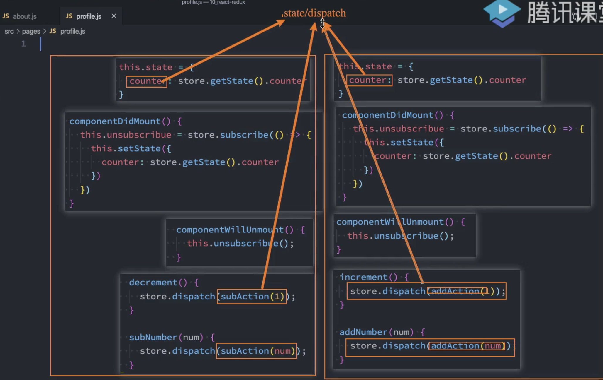

# 1. redux介绍

redux核心理念是借助action去更改store中的数据；这样针对store的修改就可以被追踪和记录

redux是单独库，可以和react使用，也可以与其他库一起使用

---
***actions:***

action本质就是一个对象，比如:

```js
{type: "ADD", payload: {counter: 2}}
```

---

**reducer:**

reducer连接state和action

reducer是纯函数；不允许修改state；为什么不许修改state？

reducer将传入的state和action结合生成一个新state

---

# 2. redux使用

## 2.1 基本使用


```js
// 基本使用
const initState = {
  counter: 0,
};

// subscribe可以订阅到state中值的变化，每当state值更新时就会调subscribe
// 注意subscribe一定要在最前面，否则先dispatch后订阅，那么订阅不到值变化
store.subscribe(() => {
  // store.getState()可以获取当state的值
  console.log('counter:', store.getState());
});

//  reducer(state第一次传入默认值，后续会将上次的进行传入)
// 不能修改state，而是结合老的state直接返回新的state
function reducer(state = initState, action) {
  switch (action.type) {
    case 'ADD':
      return { ...state, counter: state.counter + 1 };
    case 'SUB':
      return { ...state, counter: state.counter + action.num };
    default:
      return state;
  }
}

// actions
const action1 = { type: 'ADD' };
const action2 = { type: 'SUB', num: 5 };

// store（创建时需要传递reducer）
const store = redux.createStore(reducer);

// 派发action
store.dispatch(action1);
store.dispatch(action2);

```


```js
// 组件中使用
class Home extends PureComponent {
  constructor(props) {
    super(props);
    this.state = {
      counter: store.getState().counter,
    };
  }

  // 必须在这里订阅store，否则store中的state变化时 外部组件无法感知，进而组件不会render
  componentDidMount() {
    // subscribe  返回取消订阅函数
    this.unSubscribe = sotre.subscribe(() => {
      this.setState({
        counter: store.getState().counter,
      });
    });
  }

  // 必须在组件卸载时取消订阅
  componentWillUnMount() {
    this.unSubscribe();
  }

  // addAction是外部引入
  add(num) {
    // addAction(num)返回值就是action对象
    store.dispatch(addAction(num));
  }

  render() {
    return (
      <div>
        <p>{this.state.counter}</p>
        <button onClick={(e) => this.add(5)}>点我</button>
      </div>
    );
  }
}


// actions文件；写的函数返回的action其实还会对象
addAction = (num) => {
  return {
    type: 'ADD',
    num,
  };
};

```


## 2.2 redux封装connect


```js
// Home.js
class Home extends PureComponent {
  constructor(props) {
    super(props);
    this.state = {
      counter: store.getState().counter,
    };
  }

  // 必须在这里订阅store，否则store中的state变化时 外部组件无法感知，进而组件不会render
  componentDidMount() {
    // subscribe  返回取消订阅函数
    this.unSubscribe = sotre.subscribe(() => {
      this.setState({
        counter: store.getState().counter,
      });
    });
  }

  // 必须在组件卸载时取消订阅
  componentWillUnMount() {
    this.unSubscribe();
  }

  // addAction是外部引入
  add(num) {
    // addAction(num)返回值就是action对象
    store.dispatch(addAction(num));
  }

  render() {
    return (
      <div>
        <p>{this.state.counter}</p>
        <button onClick={(e) => this.add(5)}>点我</button>
      </div>
    );
  }
}


// About.js
class About extends PureComponent {
  constructor(props) {
    super(props);
    this.state = {
      counter: store.getState().counter,
    };
  }

  // 必须在这里订阅store，否则store中的state变化时 外部组件无法感知，进而组件不会render
  componentDidMount() {
    // subscribe  返回取消订阅函数
    this.unSubscribe = sotre.subscribe(() => {
      this.setState({
        counter: store.getState().counter,
      });
    });
  }

  // 必须在组件卸载时取消订阅
  componentWillUnMount() {
    this.unSubscribe();
  }

  // addAction是外部引入
  add(num) {
    // addAction(num)返回值就是action对象
    store.dispatch(addAction(num));
  }

  render() {
    return (
      <div>
        <p>{this.state.counter}</p>
        <button onClick={(e) => this.add(5)}>点我</button>
      </div>
    );
  }
}

```




由于每个组件使用redux时，都需要在componentDidMount中订阅，派发以及取消订阅等操作；所以考虑提取公共部分，只需要将不同state和dispatch传入

考虑引入一个connect工具函数，传入state和dispatch

```js
// 改装后的home.js
function Home(props) {
  return (
    <div>
      <p>home</p>
      <p>{props.counter}</p>
      <button onClick={(e) => props.add(5)}>点我</button>
    </div>
  );
}

// 把不同的状态映射到props
const mapStateToProps = (state) => {
  return {
    counter: state.counter,
  };
};

// 把不同的dispatch映射到props
const mapDispathToProps = (dispatch) => {
  return {
    add: function (num) {
      dispatch(addAction(num));
    },
    sub: function (num) {
      dispatch(subAction(num));
    },
  };
};


connect(mapStateToProps, mapDispathToProps)(Home);


// utils.js(引入store)
export default function connect(mapStateToProps, mapDispath) {
  return function enhanceHOC(WrapperedComponent) {
    return class extends PureComponent {
      constructor(props) {
        super(props);
        this.state = {
          storeState: mapStateToProps(store.getState());
        }
      }
      componentDidMount() {
        this.unSubscribe = sotre.subscribe(() => {
          // 这里不能直接写 this.setState(store.getState());  因为store.getState()中返回所有状态
          // 而这个mapStateToProps(store.getState())返回的是传入mapStateToProps参数的组件所需状态
          this.setState({
            storeState: mapStateToProps(store.getState())
          });
        });
      }
      componentWillUnMount() {
        this.unSubscribe();
      }

      render() {
        <WrapperedComponent
          {...this.props}
          {...mapStateToProps(store.getState())}
          {...mapDispath(store.dispatch)}
        />;
      }
    };
  };
}
```


