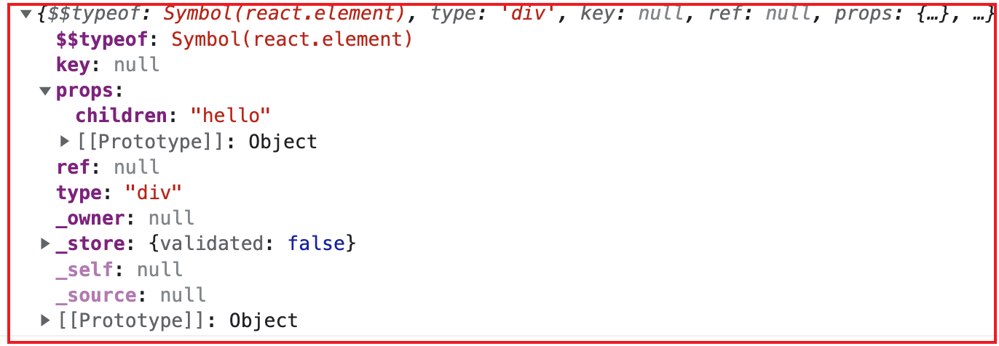

# 1. 虚拟dom创建过程

通过React.createElement方法创建返回出一个ReactElement的js对象；也就是React.createElement的返回值就是虚拟dom对象

```html
  <body>
    <div id="root"></div>
    <script
      src="https://unpkg.com/react@17/umd/react.development.js"
      crossorigin
    ></script>
    <script
      src="https://unpkg.com/react-dom@17/umd/react-dom.development.js"
      crossorigin
    ></script>

    <script>
      const msg2 = React.createElement("div", null, "hello");
    //   msg2就是虚拟dom对象树
      console.log(msg2);
      ReactDOM.render(msg2, document.getElementById("root"));
    </script>
  </body>
```



虚拟dom如何和真实dom映射？

需要借助`render()`，将虚拟的dom对象，挂载到真实dom上。（ReactDOM.render(msg2, document.getElementById("root"));）

---

`jsx -> babel -> React.createElement()函数 -> ReactElement(本质是js对象树) -> ReactDOM.render -> 浏览器真实DOM`


***总结：先将`jsx`通过`babel`转成`React.createElement()`的方式，然后`React.createElement()`返回`ReactElement`类型的虚拟dom对象；再通过`ReactDOM.render`将虚拟dom对象挂载到真实dom上。***


