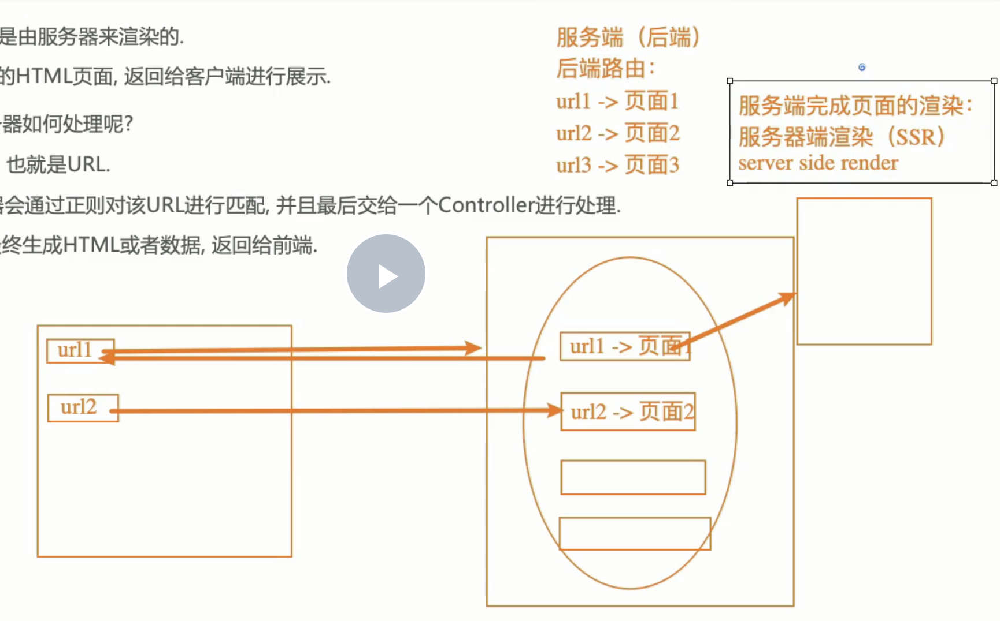
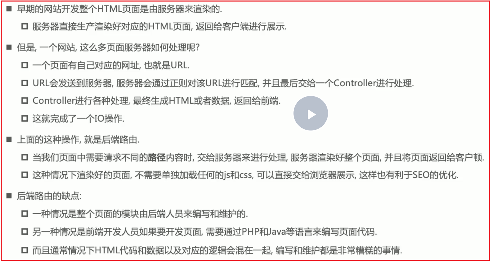
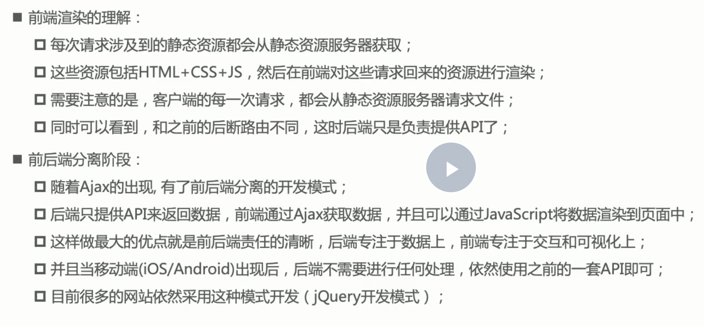
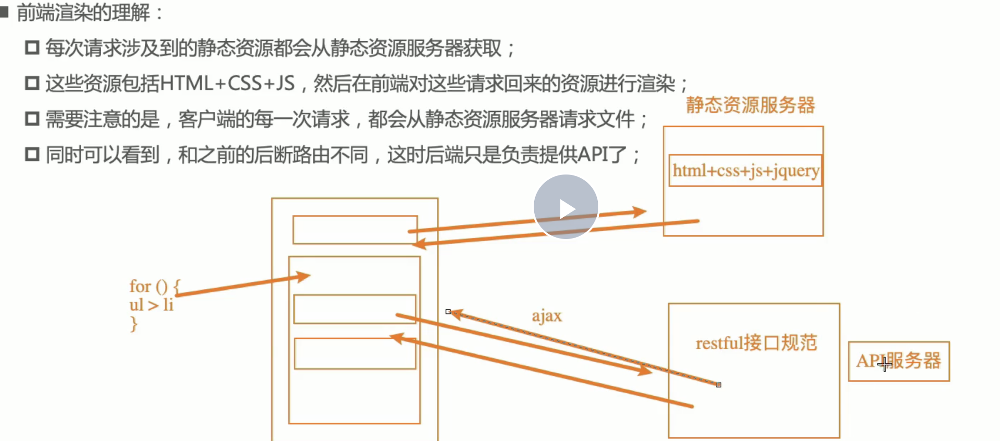
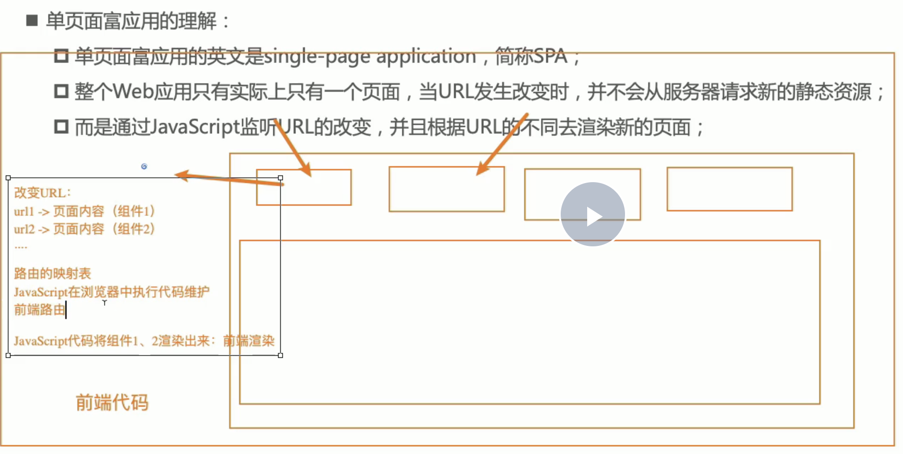
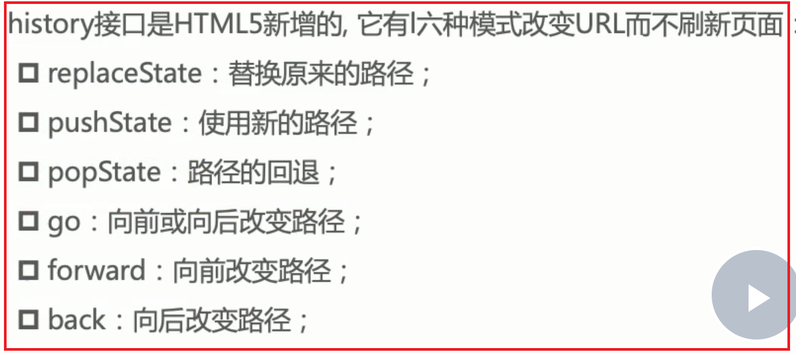
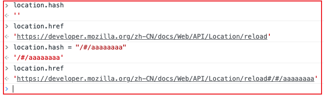
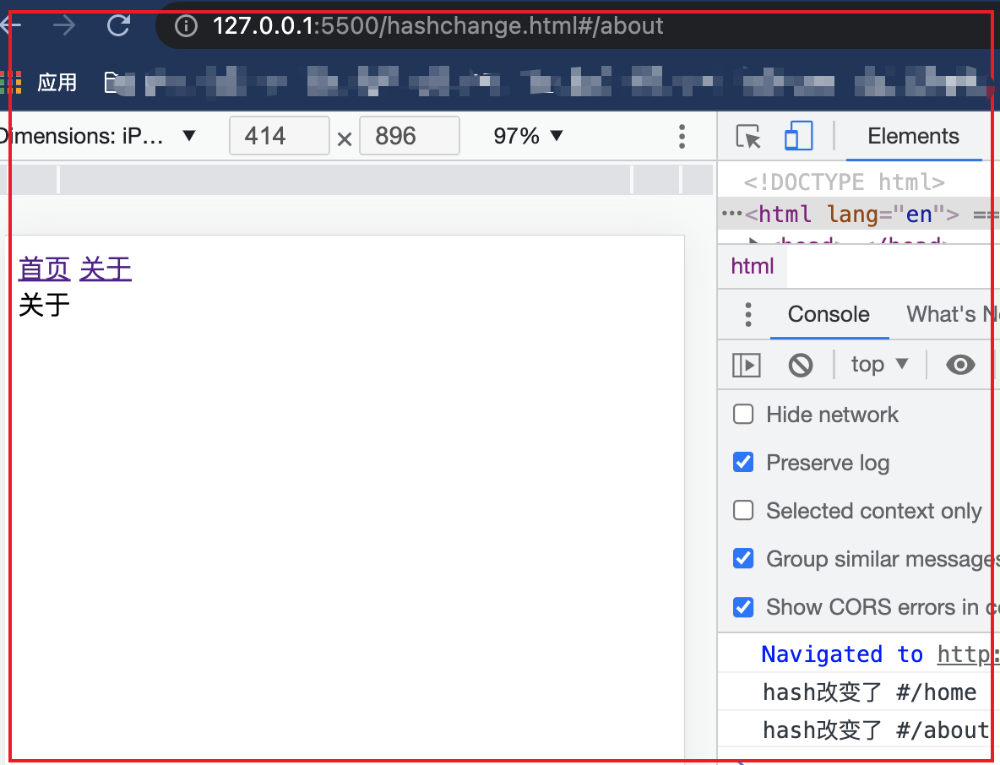
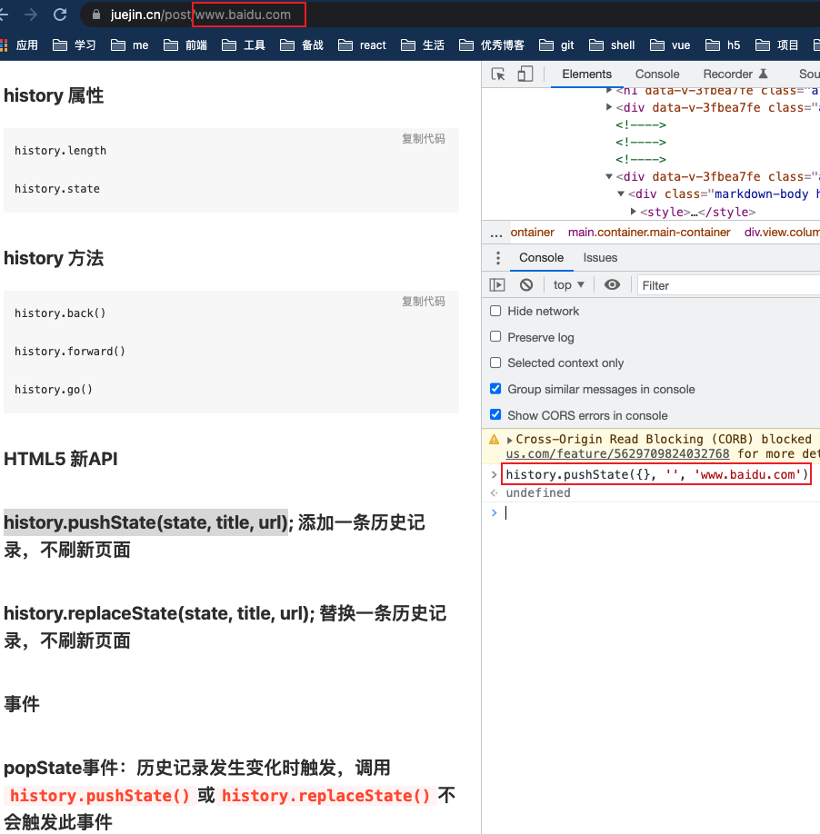

# 1. react-router4.0基本介绍
> react-router4.0 已经不再需要路由配置，一切都是组件
+ 1. react-router: 提供基础路由配置；包含基础api（Router、switch）
+ 2. react-router-dom：针对浏览器单页面开发定制的，包含`react-router`的功能，还提供其他功能（BrowserRouter、HashRouter、Router、Link、NavLink）
# 2. 路由模块安装
+ `npm install react-router-dom --save`


# 3. react-router-dom 核心用法
## 3.1 BrowserRouter和HashRouter
+ BrowserRouter和HashRouter: 相当于路由器，路由容器，并且只能包含一个组件
```js
// todo 两着区别
HashRouter：说明底层用的是hashchange的方式（url中会带）；而BrowserRouter用的是history的pushState的方式
```
## 3.2. Route
### 3.2.1 Route简介
+ 使用Route定义路由映射表，规定路由映射必须放在路由器中；
```js
// 示例1：
// path：表示要跳转的路径  component表示要渲染的页面或者组件
<Router path="/xx/xxx" component={App}/>
```
### 3.2.2 Route属性
+ path：表示要跳转的路径
+ component：表示要渲染的页面或者组件
+ render：是一个函数式组件，当前url和path匹配的时候，就会加载该函数式组件（注意跟component的区别）
```js
// 示例1：基本使用
<Router path="/xx/xxx" render={ ()=>{
    return (
      <div>要渲染的组件</div>
    );
} }/>

// 示例2：使用react-router时，无论是函数组件还是类组件，props里面都会包含一些东西，里面是当前地址的url信息
<Router path="/xx/xxx" render={ (props)=>{
    console.log(props);
    // 1. history主要做函数式导航跳转，比如在二级路由想跳转到首页
    // 2. location表示url地址信息
    // 3. match表示路由传参相关，路由url传递的参数，在match里面
    return (
      <div>要渲染的组件</div>
    );
} }/>


// 示例3：component和render的区别
<Route path="/login" component={Login} />
<Route path="/admin" render={() =>
    <Admin>
        <Switch>
            <Route path="/admin/ui/buttons" component={Buttons} />
            <Route path="/admin/ui/modals" component={Modals} />
            <Route component={NoMatch} />
        </Switch>
    </Admin>
} />
```
+ exact：精准匹配；Route的path必须和url完全匹配，一模一样（示例见switch）


## 3.3 Link和NavLink
+ link：相当于a标签的锚点超链接，用于路由跳转`<a href="#/home">首页</a>`
```js
// 示例1：
// 解析：此时需要手动在地址栏输入/home,才能跳转，如果想手动点击超链接然后自动跳转路由，可以使用link在页面做个超链接，点击之后直接跳转到路由
// to表示点击首页之后，跳转到/home路由
<Link to="/home">首页</Link>
<Link to="/news">新闻</Link>
<HashRouter>
    <Route path="/home" component={Home}/>
    <Route path="/news" component={News}/>
</HashRouter>
```
+ NavLink： 也是路由跳转, 有更多其他属性，比如被选中时显示颜色
## 3.4. Switch
+ switch: 从上到下只要匹配到就停止，不会再向下匹配了
+ react-router中的路由匹配规则是从上到下全部匹配一遍，如果能匹配上就渲染出来，不会终止；Route中的path只要能在url中找的到，就算匹配
```js
// 示例1：Route中的path只要能在url中找的到，就算匹配
// 解析：此时地址栏出现 /home 时，路由第一行的 / 被 /home 中的 / 完全匹配；/home也能匹配路由中的第二行/home，所以此时/路由和/home路由都会被渲染
<HashRouter>
    <Route path="/" component={Home}/>
    <Route path="/home" component={Home}/>
    <Route path="/news" component={News}/>
</HashRouter>

// 解决办法：利用exact属性精准匹配（注意但是如果Route很多，在所有的path前增加exact会很麻烦，所以采用switch的方式，匹配到就不再匹配了）
<HashRouter>
    // exact 属性设置的path精准匹配必须跟 url地址栏一模一样才会被匹配上
    <Route exact path="/" component={Home}/>
    <Route path="/home" component={Home}/>
    <Route path="/news" component={News}/>
</HashRouter>
```
```js
// 示例1：
// 说明：因为路由匹配规则默认会全部匹配一遍，匹配到了也不会停止，继续向下匹配，switch匹配到就停止，不会再向下匹配了
<HashRouter>
    // 此时url/news 则路由/:name和/news 会被匹配到 所以都会执行，此时可以使用switch，从上到下匹配到第一个满足条件的旧停止向下匹配
<switch>
    <Route exact path="/" component={Home}/>
    <Route path="/:name" component={(props)=>{
        return (
          <p>props.match.params.name<p>
        );
    }}/>
    <Route path="/news" component={News}/>
</switch>
</HashRouter>
```
+ 404-notfound
```js
// 示例1：switch中如果都匹配不到，我们需要给默认写个默认执行的路由，这个默认路由不需要写path
<switch>
    <Route exact path="/" component={Home}/>
    <Route path="/name" component={(props)=>{
        return (
          <p>hello<p>
        );
    }}/>
    <Route path="/news" component={News}/>
    <Route component={NotFound}/>
</switch>

// 示例2：
<switch>
    <Route exact path="/" component={Home}/>
    <Route path="/name" component={(props)=>{
        return (
          <p>hello<p>
        );
    }}/>
    <Route path="/news" component={News}/>
    <Route path='/notfound' component={NotFound}/>
    // 表示上面的路由都不满足条件时，跳转到to对应的url，这时候跳转到/notfound路由，执行渲染NotFound
    <Redirect from='*' to='/notfound' />
</switch>
```


## 3.5. redirect
+ <Redirect>组件用于路由的跳转，即用户访问一个路由，会自动跳转到另一个路由
- redirect跳转和link跳转的区别是link需要手动点击才进行跳转，而Redirect是自动跳转
```js
// 示例1：访问/inbox/messages/5，会自动跳转到/messages/5
<Route path="inbox" component={Inbox}>
  ＜Redirect from="messages/:id" to="/messages/:id" />
</Route>
```
# 4. 路由属性值
+ 1. `this.props.children属性`：表示子组件

# 获取动态路由值
+ 1. `:paramName`动态路由：这个动态路由值可以通过`this.props.match.params.paramName`取出
+ 2. 通过`useParams`
```js
// 示例1：
import { useParams } from "react-router-dom";
<Route path="/:id" children={<Child />} />
let { id } = useParams();
```

# 5. 嵌套路由&路由参数
```js
// 示例1：
// App.js

<ul>
    <li><Link to="/home">首页</Link></li>
    <li><Link to="/news">新闻</Link></li>
</ul>
<Router>
    <Route path="/home" component={Home}>
    <Route path="/news" component={News}>
</Router>

// New.js： 注意二级路由的path前需要加上一级路由的news
render(){
  return (
      <div>
          <ul>
              <li><Link to="/news/detail/1">新闻第一篇</Link></li>
              <li><Link to="/news/detail/2/4">新闻第2篇</Link></li>
          </ul>
          <Route path="/news/detail/:newId/:type" component={Detail}>
      </div>
  );
}

// Detail.js
render(){
  return (
      <div>
          newId: {this.props.match.params.newId}---type:{this.props.match.params.type}
      </div>
  );
}
```


# 6. 嵌套路由
+ `this.props.children`: 当app组件中不确定接下来展示什么子组件，使用this.props.children代替
```js
// 示例1：用户访问/repos时，会先加载App组件，然后在它的内部再加载Repos组件
<Router history={hashHistory}>
  <Route path="/" component={App}>
    <Route path="/repos" component={Repos}/>
    <Route path="/about" component={About}/>
  </Route>
</Router>

// App组件： App组件的this.props.children属性就是子组件
export default React.createClass({
  render() {
    return <div>
      {this.props.children}
    </div>
  }
})

// 相当于
<App>
  <Repos/>
</App>
```

```js
// 示例2：子路由可以使用render方法  render方法中的箭头函数体不需要大括号; 不加大括号默认就会加return，加了大括号就必须加手动加return
<Router>
    <Home>
        <Switch>
            <Route path="/main" render = { () =>
                <Main>
                    <Route path="/main/a" component={Main}>
                </Main>
            } >
            <Route path="/about" component={About}>
            <Route exact={true} path="/about/abc" component={About}>
            <Route path="/dashboard" component={Dashboard}>
            <Route component={NoMatch}>
        </Switch>
    </Home>
</Router>
```
# 7. 使用路由方式
## 7.1 路由组件混合
```js
// 示例1：
export default function BasicExample() {
  return (
    <Router>
      <div>
        <ul>
          <li>
            <Link to="/">Home</Link>
          </li>
          <li>
            <Link to="/about">About</Link>
          </li>
          <li>
            <Link to="/dashboard">Dashboard</Link>
          </li>
        </ul>

        <hr />

        <Switch>
          <Route exact path="/">
            <Home />
          </Route>
          <Route path="/about">
            <About />
          </Route>
          <Route path="/dashboard">
            <Dashboard />
          </Route>
        </Switch>
      </div>
    </Router>
  );
}

// 下面这3个组件分别写个页面

function Home() {
  return (
    <div>
      <h2>Home</h2>
    </div>
  );
}

function About() {
  return (
    <div>
      <h2>About</h2>
    </div>
  );
}

function Dashboard() {
  return (
    <div>
      <h2>Dashboard</h2>
    </div>
  );
}
```
## 7.2 路由单独配置
```js
// 示例1：
// IRouter.js
<Router>
    <Home>
        <Route exact={true} path="/" component={Main}>
        <Route path="/about" component={About}>
        <Route path="/dashboard" component={Dashboard}>
    </Home>
</Router>

// Home.js
<div>
    <ul>
        <li>
            <Link to="/">Main</Link>
        </li>
        <li>
            <Link to="/about">About</Link>
        </li>
        <li>
            <Link to="/dashboard">Dashboard</Link>
        </li>
    </ul>
    <hr />
    {this.props.children}
</div>
```
## 7.3 借助react-router-config进行配置
```js
```
            
            
# 8. 404路由
+ 不写path, 直接写component
```js
// 示例1：
<Router>
    <Home>
        <Switch>
            <Route path="/main" render = { () =>
                <Main>
                    <Route path="/main/a" component={Main}>
                </Main>
            } >
            <Route path="/about" component={About}>
            <Route exact={true} path="/about/abc" component={About}>
            <Route path="/dashboard" component={Dashboard}>
            <Route component={NoMatch}>
        </Switch>
    </Home>
</Router>
```

                
                
# 8. 手动跳转路由

**手动跳转路由有两种方式：**

**方式1**：通过路由link管理渲染的组件about，通过路由渲染时about组件中就会被加入3个属性（this.porps.history && this.props.location && this.props.match）

比如场景： 比如在App的render中通过link路由跳转到About组件，在about组件的render中嵌套子路由，比如about的render中点击一个button，然后触发一个点击事件，在点击事件中通过this.props.history.push的方式跳转

```js
// App.js
export default function App() {
  return (
    <div>
      <Link to="/about">关于</Link>
      <HashRouter>
        <Route path="/about" component={About} />
      </HashRouter>
    </div>
  );
}

// About.js
function aboutJoinUs(props) {
  return <div>加入我们</div>;
}

function aboutConnact(props) {
  return <div>联系我们</div>;
}

export default class About extends React.PureComponent {
  constructor(props) {
    super(props);
  }
  handleClick() {
    console.log(this.props.history);
    console.log(this.props.location);
    console.log(this.props.match);
    // 这里之所以可以访问this.props.history，因为当前的About组件是通过Router中的link管理跳转渲染的
    // 如果没有router管理About，而是直接<About />渲染，那么无法访问到history
    this.props.history.push('/about/join');
  }
  render() {
    return (
      <div>
        <Link to="/about/connact"></Link>
        <button onClick={(e) => this.handleClick}>加入我们</button>
        <Switch>
          <Route path="/about/connact" component={aboutConnact}></Route>
          <Route path="/about/join" component={aboutJoinUs}></Route>
        </Switch>
      </div>
    );
  }
}
```

**方式2：** 通过withRouter这个高阶组件传入

```js
// 备注：方式1中的About中可以访问this.props.history，是因为about组件是通过link路由跳转的，由router路由渲染管理了；所以会附加3个属性history/location/match
export default class App extends PureComponent() {
  handleClick(){
    // 这里在this.props.history不存在，因为App组件并没有通过router路由渲染出来，而是通过直接渲染ReactDOM.render(<App />, document.getElementById("root"));
    // 所以取不到Router附件的3个属性；此时可以采用高阶组件withRouter
    this.props.history.push('/about');
  }
  return (
    <div>
      <Link to="/about">关于</Link>
      <button onClick={(e) => this.handleClick}>点我</button>
      <HashRouter>
        <Route path="/about" component={About} />
      </HashRouter>
    </div>
  );
}

```


```js
// withRouter高阶组件可以给组件额外增加属性
// index.js
import React from "react";
import ReactDOM from "react-dom";

import App from "./App";


//  这里App是被withRouter的返回，这里的App必须包含在HashRouter或者browserRouter中，否则获取不到router管理的history和location以及match属性
ReactDOM.render(
  <HashRouter>
    <App />
   </HashRouter>,
   document.getElementById("root"));


// App.js
class App extends PureComponent() {
  handleClick(){
    this.props.history.push('/about');
  }
  return (
    <div>
      <Link to="/about">关于</Link>
      <button onClick={(e) => this.handleClick}>点我</button>
      <Route path="/about" component={About} />
    </div>
  );
}
export default withRouter(App)
```


---
---


# 1. 路由历史简介

## 1.1 阶段1之后端路由

后端路由：是每个url对应一个server返回的页面（路由映射关系在后端维护），并且页面中script脚本之类的已经全部解析为js代码





## 1.2 阶段2之前后端分离

querydiff：页面html在后端，js和css在静态服务器；用户通过url访问到后端html，html中嵌入的是打包好的bundleJs链接和css链接，再去请求静态服务器的js和css





## 1.3 阶段3之前端路由(spa单页面应用)

spa：前端路由；url和页面映射关系在前端维护，只有一个html页面，页面内容变化时通过router路由改变对应path，进入渲染不同的组件完成



# 2.前端路由原理 


**前端路由/spa单页面路由原理：**

1. 改变url，但是页面不要进行强制刷新（a标签不行）
2. 自己来监听url的改变，并且改变之后，我们自己改变页面的内容(渲染对应的组件)

---

**那么改变url，同时又不引起页面刷新的办法有两种：**

1. 通过url的hash改变url

比如将`localhost:3000/`通过hash方式修改`localhost:3000/#/abc`;此时页面不刷新。但url多了个`#`,看起来别扭

2. 通过h5的history模式修改url



---

## 2.1 url的hash

**url的hash的本质是锚点；通过改变location.hash的值，进而改变location.href；此时页面不会刷新**




```html
// hashchange
<!DOCTYPE html>
<html lang="en">
  <head>
    <meta charset="UTF-8" />
    <meta http-equiv="X-UA-Compatible" content="IE=edge" />
    <meta name="viewport" content="width=device-width, initial-scale=1.0" />
    <title>Document</title>
  </head>
  <body>
    <a href="#/home">首页</a>
    <a href="#/about">关于</a>
    <div class="router-views">
      <!-- 这里是hash切换时显示内容区域 -->
    </div>
    <script>
      let viewDom = document.querySelector(".router-views");
      window.addEventListener("hashchange", () => {
        console.log("hash改变了", location.hash);
        switch (location.hash) {
          case "#/home":
            viewDom.innerHTML = "首页";
            break;
          case "#/about":
            viewDom.innerHTML = "关于";
            break;
          default:
            viewDom.innerHTML = "";
            break;
        }
      });
    </script>
  </body>
</html>

```



## 2.2 监听history改变




                
以上6种api都是地址栏变化，但是页面不刷新；
                
**备注：调用`history.pushState()`或者`history.replaceState()`不会触发`window.popstate`事件. `popstate`事件只会在浏览器某些行为下触发, 比如点击后退、前进按钮(或者在JavaScript中调用`history.back()、history.forward()、history.go()`方法)，此外`a`标签的锚点也会触发该事件.**

**pushState和replaceState不会触发hashchange**

```html
<!DOCTYPE html>
<html lang="en">
  <head>
    <meta charset="UTF-8" />
    <meta http-equiv="X-UA-Compatible" content="IE=edge" />
    <meta name="viewport" content="width=device-width, initial-scale=1.0" />
    <title>Document</title>
  </head>
  <body>
    <a href="/home">首页</a>
    <a href="/about">关于</a>
    <div class="router-views">
      <!-- 这里是hash切换时显示内容区域 -->
    </div>
    <script>
      let viewDom = document.querySelector(".router-views");
      let aDoms = document.getElementsByTagName("a");

      for (let aElem of aDoms) {
        // 1. a标签有默认点击跳转行为，所以需要手动监听a标签的点击事件，然后手动阻止a标签的默认点击行为
        aElem.addEventListener("click", (e) => {
          console.log("被点击了");
          e.preventDefault();

          // 2. 通过history.pushState的方式修改url
          let href = aElem.getAttribute("href");
          history.pushState({}, "", href);

          // 3. url变化router-views渲染对应内容
          urlChange();
        });
      }
      function urlChange() {
        switch (location.pathname) {
          case "/home":
            viewDom.innerHTML = "首页";
            break;
          case "/about":
            viewDom.innerHTML = "关于";
            break;
          default:
            viewDom.innerHTML = "";
            break;
        }
      }

      // 4. 这里需要监听点击前进后退按钮时，对应的页面内容也需要变化
      window.addEventListener("popstate", (e) => {
        urlChange();
      });
    </script>
  </body>
</html>

```


# 3.history附录

```js
// 相当于点击回退
window.history.back();

// 前进
window.history.forward();


// 当前页面0，-1是相当于back；go跳转到指定页面
window.history.go(-1);

```

```js
// 添加和修改历史记录的条目

// pushState向url栈中增加一条记录
history.pushState(stateObj, "page 2", "bar.html");

// replaceState()：替换当前url记录
history.pushState(stateObj, "page 2", "bar.html");

```


