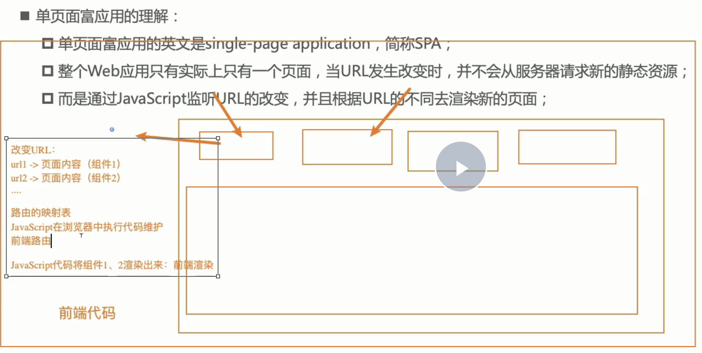
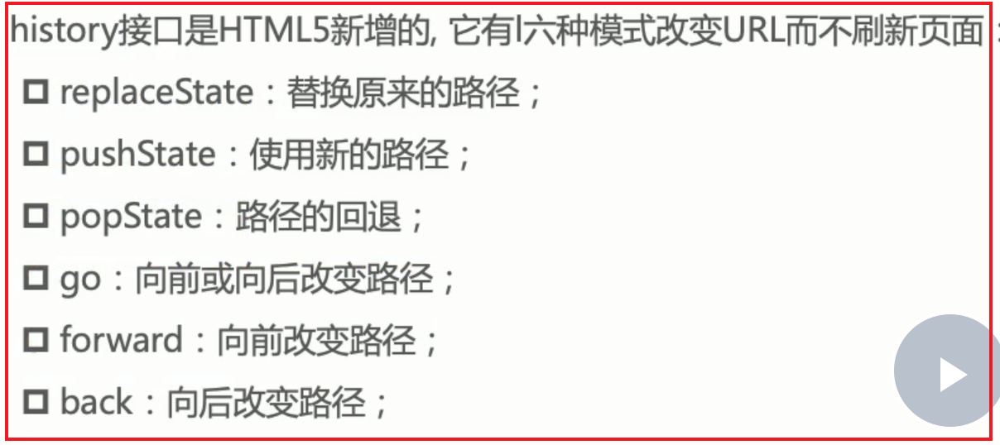

# 1. 路由历史简介

## 1.1 阶段1之后端路由

后端路由：是每个url对应一个server返回的页面（路由映射关系在后端维护），并且页面中script脚本之类的已经全部解析为js代码


## 1.2 阶段2之前后端分离

querydiff：页面html在后端，js和css在静态服务器；用户通过url访问到后端html，html中嵌入的是打包好的bundleJs链接和css链接，再去请求静态服务器的js和css


## 1.3 阶段3之前端路由(spa单页面应用)

spa：前端路由；url和页面映射关系在前端维护，只有一个html页面，页面内容变化时通过router路由改变对应path，进入渲染不同的组件完成



# 2.前端路由原理 


**前端路由/spa单页面路由原理：**

1. 改变url，但是页面不要进行强制刷新（a标签不行）
2. 自己来监听url的改变，并且改变之后，我们自己改变页面的内容(渲染对应的组件)

---

**那么改变url，同时又不引起页面刷新的办法有两种：**

1. 通过url的hash改变url

比如将`localhost:3000/`通过hash方式修改`localhost:3000/#/abc`;此时页面不刷新。但url多了个`#`,看起来别扭

2. 通过h5的history模式修改url



---

## 2.1 url的hash

**url的hash的本质是锚点；通过改变location.hash的值，进而改变location.href；此时页面不会刷新**


```html
// hashchange
<!DOCTYPE html>
<html lang="en">
  <head>
    <meta charset="UTF-8" />
    <meta http-equiv="X-UA-Compatible" content="IE=edge" />
    <meta name="viewport" content="width=device-width, initial-scale=1.0" />
    <title>Document</title>
  </head>
  <body>
    <a href="#/home">首页</a>
    <a href="#/about">关于</a>
    <div class="router-views">
      <!-- 这里是hash切换时显示内容区域 -->
    </div>
    <script>
      let viewDom = document.querySelector(".router-views");
      window.addEventListener("hashchange", () => {
        console.log("hash改变了", location.hash);
        switch (location.hash) {
          case "#/home":
            viewDom.innerHTML = "首页";
            break;
          case "#/about":
            viewDom.innerHTML = "关于";
            break;
          default:
            viewDom.innerHTML = "";
            break;
        }
      });
    </script>
  </body>
</html>

```


## 2.2 监听history改变


```html
<!DOCTYPE html>
<html lang="en">
  <head>
    <meta charset="UTF-8" />
    <meta http-equiv="X-UA-Compatible" content="IE=edge" />
    <meta name="viewport" content="width=device-width, initial-scale=1.0" />
    <title>Document</title>
  </head>
  <body>
    <a href="/home">首页</a>
    <a href="/about">关于</a>
    <div class="router-views">
      <!-- 这里是hash切换时显示内容区域 -->
    </div>
    <script>
      let viewDom = document.querySelector(".router-views");
      let aDoms = document.getElementsByTagName("a");

      for (let aElem of aDoms) {
        // 1. a标签有默认点击跳转行为，所以需要手动监听a标签的点击事件，然后手动阻止a标签的默认点击行为
        aElem.addEventListener("click", (e) => {
          console.log("被点击了");
          e.preventDefault();

          // 2. 通过history.pushState的方式修改url
          let href = aElem.getAttribute("href");
          history.pushState({}, "", href);

          // 3. url变化router-views渲染对应内容
          urlChange();
        });
      }
      function urlChange() {
        switch (location.pathname) {
          case "/home":
            viewDom.innerHTML = "首页";
            break;
          case "/about":
            viewDom.innerHTML = "关于";
            break;
          default:
            viewDom.innerHTML = "";
            break;
        }
      }

      // 4. 这里需要监听点击前进后退按钮时，对应的页面内容也需要变化
      window.addEventListener("popstate", (e) => {
        urlChange();
      });
    </script>
  </body>
</html>

```


# history附录

```js
// 相当于点击回退
window.history.back();

// 前进
window.history.forward();


// 当前页面0，-1是相当于back；go跳转到指定页面
window.history.go(-1);

```

```js
// 添加和修改历史记录的条目

// pushState向url栈中增加一条记录
history.pushState(stateObj, "page 2", "bar.html");

// replaceState()：替换当前url记录
history.pushState(stateObj, "page 2", "bar.html");

```


**备注：调用`history.pushState()`或者`history.replaceState()`不会触发`window.popstate`事件. `popstate`事件只会在浏览器某些行为下触发, 比如点击后退、前进按钮(或者在JavaScript中调用`history.back()、history.forward()、history.go()`方法)，此外`a`标签的锚点也会触发该事件.**

**pushState和replaceState不会触发hashchange**


