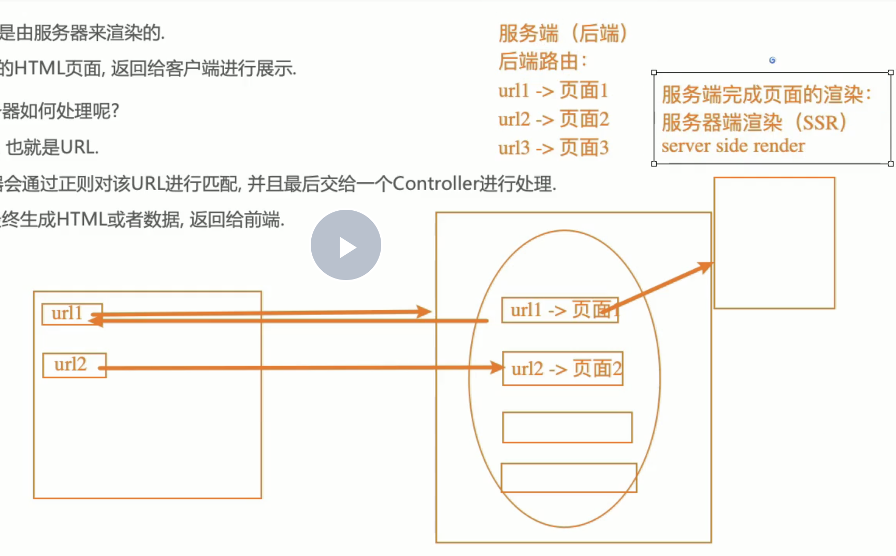
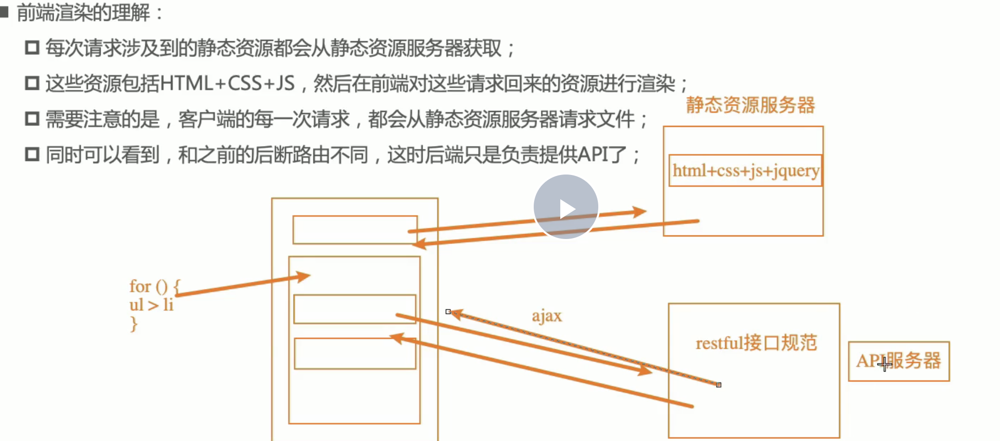

# 1. 路由历史简介

## 1.1 阶段1之后端路由

后端路由：是每个url对应一个server返回的页面（路由映射关系在后端维护），并且页面中script脚本之类的已经全部解析为js代码

## 1.2 阶段2之前后端分离

querydiff：页面html在后端，js和css在静态服务器；用户通过url访问到后端html，html中嵌入的是打包好的bundleJs链接和css链接，再去请求静态服务器的js和css

## 1.3 阶段3之前端路由(spa单页面应用)

spa：前端路由；url和页面映射关系在前端维护，只有一个html页面，页面内容变化时通过router路由改变对应path，进入渲染不同的组件完成

# 2.前端路由原理 

**前端路由/spa单页面路由原理：**

1. 改变url，但是页面不要进行强制刷新（a标签不行）
2. 自己来监听url的改变，并且改变之后，我们自己改变页面的内容(渲染对应的组件)

---

**那么改变url，同时又不引起页面刷新的办法有两种：**

1. 通过url的hash改变url

比如将`localhost:3000/`通过hash方式修改`localhost:3000/#/abc`;此时页面不刷新。但url多了个`#`,看起来别扭

2. 通过h5的history模式修改url

---

## 2.1 url的hash

**url的hash的本质是锚点；通过改变location.hash的值，进而改变location.href；此时页面不会刷新**

